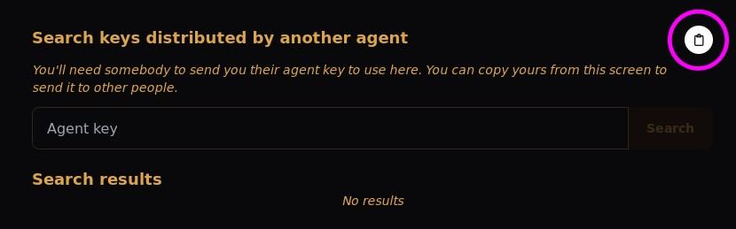

## Publisher guide

The role of a publisher is to sign assets that they have created or are responsible for. This is a good way to bootstrap
the verification process for your users. Over time, as people fetch your assets and sign them, your initial signature is
less likely to be needed.

### The simple way

The simplest way to get started is to follow the [user guide](./user-guide.md) first. Then you can fetch your own 
asset to produce a signature for it:

```bash
checked fetch <URL>
```

This way when somebody else fetches your asset, there will be at least one signature for them to check against.

### The recommended way

The recommended way is to sign your asset locally and publish those signatures. This has the advantage that you don't 
have to trust the host that you are uploading the asset to.

You just need to know the URL where the asset is hosted. If you know this ahead of time then you can create the 
signature before uploading the asset. Otherwise, you should upload the asset first to get the URL.

Create the signature with the following command:

```bash
checked sign <URL> --file <path-to-asset>
```

Or if you're using a key that isn't the default:

```bash
checked sign <URL> --file <path-to-asset> --name <key-name>
```

When prompted to distribute the signature, confirm and the signature will be published on Holochain.

If you check the "My Assets" page in the UI, you should see the asset listed.


As a bonus, you can fetch your own asset and check that the signature is valid:

```bash
checked fetch <URL>
```

In the signature report, you will see your own signature being checked. This signature check will pass if the 
file that you signed locally is identical to the one that was provided to you when fetched it from the asset URL.

### Keep your signature in use

*Here be dragons!* It is possible to provide improved security using the feature described here but it relies on you
implementing it as securely as possible and communicating the risks to your users so that they can make informed 
decisions about how to use it.

Your initial signature is likely to get selected for verification when there are few signatures available. If there are
only a few signatures produced in a short time after the asset was published, then your signature still has a reasonable
chance of getting selected. However, if there are many signatures then yours is less likely to be selected. This is not
a problem if the most users are receiving the original asset and producing valid signatures. It is a problem if enough
agents are maliciously producing mismatched signatures.

To provide an option for users to 'pin' the key you used to sign the asset, you can distribute your agent key and the 
name of the key that you used to sign the asset. 



This allows users to search for your keys and pin the one that you
used. This doesn't guarantee that your signature will be selected because a user might choose to pin multiple keys that
have been used to sign the asset. However, it does increase the chances that your signature will be selected.

It is not possible for a malicious actor to force a user to pin a key. However, if you distribute your agent key in a 
place that could potentially be modified by a malicious actor, then your users could be tricked into pinning a key that
is not yours. You should choose a secure way to distribute your agent key, and communicate expectations to your users
for where they should look and when it's really you, the publisher, asking them to take actions with pinned keys.
