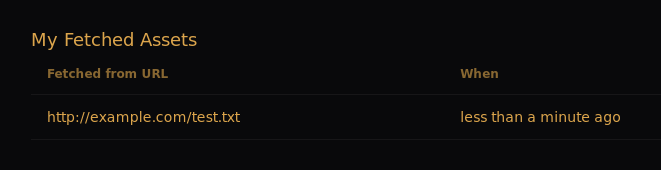

## Publisher guide

### The simple way

The simplest way to get started is to follow the [user guide](./user-guide.md) first. Then you can fetch your own 
asset to produce a signature for it.

This way when somebody else fetches your asset, there will be at least one signature for them to check against.

### The recommended way

The recommended way is to sign your asset locally and publish those signatures. This has the advantage that you don't 
have to trust the host that you are uploading the asset to.

You just need to know the URL where the asset is hosted. If you know this ahead of time then you can create the 
signature before uploading the asset. Otherwise, you should upload the asset first to get the URL.

Create the signature with the following command:

```bash
checked sign <URL> --file <path-to-asset>
```

Or if you're using a key that isn't the default:

```bash
checked sign <URL> --file <path-to-asset> --name <key-name>
```

When prompted to distribute the signature, confirm and the signature will be published on Holochain.

If you check the "My Assets" page in the UI, you should see the asset listed.



As a bonus, you can fetch your own asset and check that the signature is valid:

```bash
checked fetch <URL>
```

In the signature report, you will see your own signature being checked. This signature check will pass if the 
file that you signed locally is identical to the one that was provided to you when fetched it from the asset URL.
